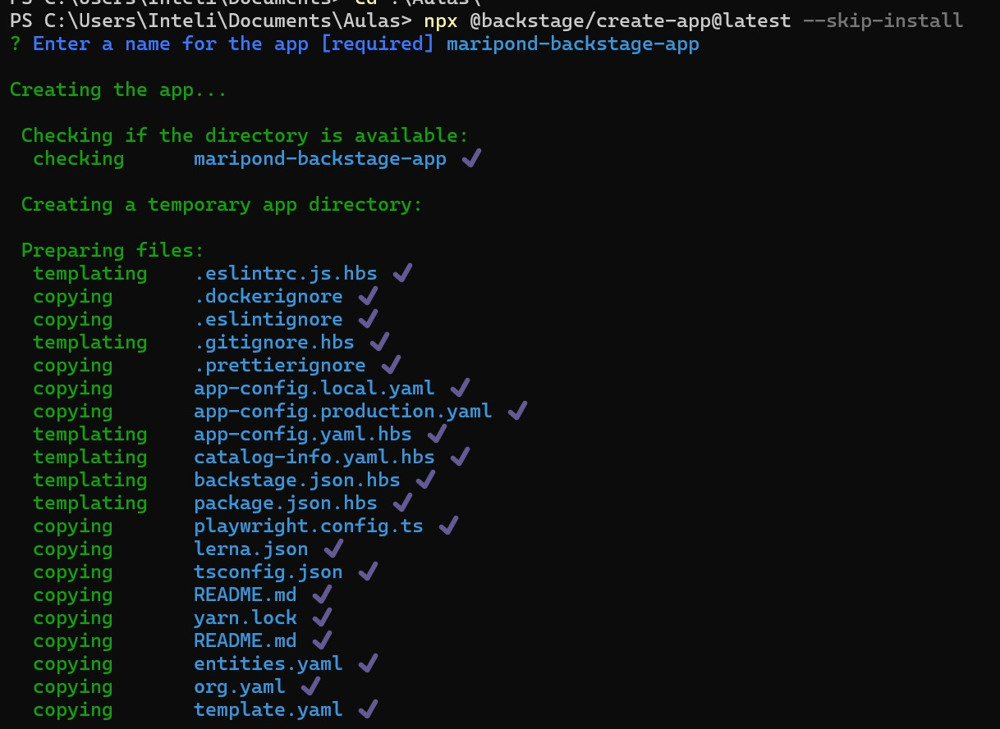
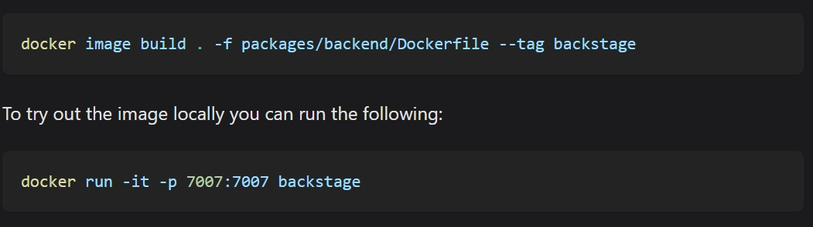
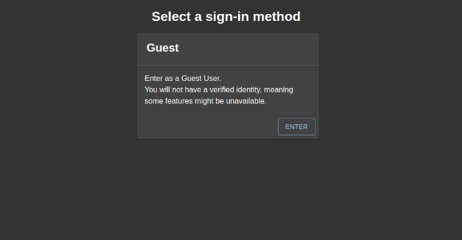
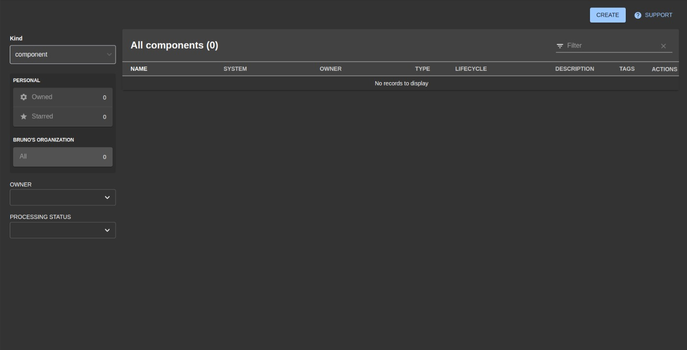

# Ponderada Backstage 

Atividade realizada seguindo o tutorial: https://backstage.io/docs/deployment/, para fazer deploy de um catalogo de serviço, com backstage 

## Backstage

O Backstage é uma plataforma de código aberto desenvolvida pelo Spotify para gerenciar microserviços. Ele centraliza ferramentas e operações, facilitando o acesso e organização para desenvolvedores. A plataforma permite visualizar informações de serviços, gerenciar ciclos de vida e integrar ferramentas de CI/CD, melhorando a eficiência e a colaboração das equipes. Com o Backstage, empresas podem otimizar processos e manter um ambiente de desenvolvimento mais organizado e produtivo.

Para começar o tutorial, é necessário criar o backstage app, com o uso do comando
```
npx @backstage/create-app@latest
```
como na imagem a seguir



Depois é necessário rodar os comandos

- yarn install
- yarn dev

É necessário também o comando de build final 



seguindo os demais passos dessa etapa, será concluído o build da imagem em docker 

Depois disso é necessário fazer o setup do Frontend, que vai ser uma diferente imagem em docker 
- Necessário criar e adicionar tudo do script do frontend, necessário para a execução e depois a imagem


O resultado final com as funcionalidade rodando está a seguir: 





 ## Tecnologias utilizadas

 - Backstage
 - Docker
